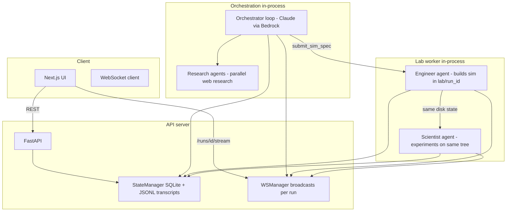

# Automated Capacity

A system for **scaling experimental capacity** by automatically spinning up **simulated laboratories**: sandboxed coding agents that **build** runnable simulations, then **use** those simulations as **ground-truth environments** to run structured experiments and answer research questions—without requiring a human to manually implement each simulator or lab setup.

---

## Why this exists

Real experimental throughput is limited by how many physical or bespoke computational setups you can stand up, validate, and iterate on. This project pushes that boundary by:

1. **Researching** the problem space (literature, benchmarks, open-source simulators).
2. **Designing** a formal **simulation specification** (SimSpec) that describes what to build, how to validate it, and what the scientist may change.
3. **Engineering** a working **lab** in an isolated workspace (`lab/<run_id>/`): code, dependencies, optional live metric streams to the UI.
4. **Experimenting** on top of that lab: a second agent runs trials, varies parameters in allowed files, and produces findings—treating the built simulator as the **ground truth** for “what would happen if we changed X?” within the sandbox.

The goal is not to replace human judgment, but to **multiply how many distinct research questions can be turned into executable, comparable experiments** in software, with clear handoffs and audit trails.

---

## Core ideas

| Concept | Meaning |
|--------|---------|
| **Simulated lab** | A self-contained directory + process where a simulation runs: install steps, scripts, metrics, and (optionally) streaming charts/logs to a browser. |
| **Sandboxed coding agent** | The engineer runs with tools (`bash`, `read`, `edit`, `search`, `web_fetch`, timers, streams, etc.) inside a bounded workspace and time budget—not arbitrary internet execution outside that scope. |
| **Ground truth** | Once the engineer validates the sim against the SimSpec’s criteria, the scientist treats that codebase and its outputs as the environment for hypothesis testing and reporting. |
| **Experimental capacity** | Many runs can be created in parallel (each with its own run ID, state, and transcripts); the architecture separates **orchestration**, **build**, and **experiment** phases so they can scale independently (e.g. more workers or larger machines later). |

Prompts encourage **reusing existing open-source simulators and benchmarks** when possible, and only specifying greenfield builds when the question or evidence demands it.

---

## Architecture (high level)



### Components

1. **`server/` — Control plane**
   - **FastAPI** app (`server/app.py`): CORS, routes, lifecycle.
   - **Runs** (`server/routes/runs.py`): create runs, list, fetch; creating a run starts the **orchestrator** as a background task.
   - **Agents** (`server/routes/agents.py`): heartbeats, transcript chunks, completion callbacks—used to advance phases (e.g. engineer done → scientist running → complete).
   - **Streams** (`server/routes/streams.py`): stream metadata and data for live UI components.
   - **WebSocket** (`server/routes/ws.py`): one connection per run; initial **snapshot** then **events** (`phase_change`, `transcript`, `research_update`, `complete`, `error`, …).
   - **State** (`server/state.py`): SQLite for runs, agents, streams; JSONL files for per-agent transcripts.
   - **Models** (`server/models.py`): `SimSpec`, `Run`, `AgentState`, etc.

2. **`orchestrator/` — Research director**
   - **Loop** (`orchestrator/loop.py`): Claude (Anthropic **Bedrock**) tool-use loop with a dedicated orchestrator transcript agent id (`{run_id}-orch`).
   - **Tools** (`orchestrator/tools.py`):
     - `run_research` — parallel research queries, findings persisted on the run, UI updated via WebSocket.
     - `submit_sim_spec` — validates a **SimSpec**, records engineer/scientist agents, and starts **`agents.harness.run_both_phases`** asynchronously.
     - `report_failure` — marks the run failed with a reason.
   - **Prompts** (`orchestrator/prompts.py`): system instructions for designing SimSpecs and favoring existing sims when appropriate.

3. **`agents/` — Sandbox workers**
   - **Research** (`agents/research.py`): lightweight Bedrock agents with `web_fetch` to gather evidence for the orchestrator.
   - **Harness** (`agents/harness.py`): runs **engineer** then **scientist** in `lab/<run_id>/`, same process as the server today; streams file-based metrics to the server, heartbeats, transcripts.
   - **Engineer** (`agents/engineer.py`): system prompt + initial user context (SimSpec + research traces + time budget).
   - **Scientist** (`agents/scientist.py`): prompt + engineer handoff + SimSpec.
   - **Tools** (`agents/tools/`): bash, edit, read, search, web_fetch, timer, `create_stream`, `signal_done`, etc.

4. **`shared/`**
   - **`config.py`**: environment-driven models, AWS region, timeouts, server port, optional EC2-related env vars for future/alternate deployments.
   - **`protocol.py`**: Pydantic types for wire payloads (heartbeats, transcripts, streams, agent boot payloads).

5. **`frontend/` — Dashboard**
   - Next.js UI: sessions, live run cards (orchestrator feed, research, engineer build log, scientist activity), WebSocket-driven updates (`NEXT_PUBLIC_API_URL` should point at the FastAPI origin for REST + `ws://`).

---

## End-to-end flow

1. User **POSTs** a research **question** → new **run** row, orchestrator task starts.
2. **Orchestrator** calls **`run_research`** → parallel queries, findings stored, UI shows progress.
3. **Orchestrator** calls **`submit_sim_spec`** with fields such as `setup_instructions`, `metric_schema`, `mutable_files`, `validation_criteria`, `data_sources`.
4. **Engineer** builds under `lab/<run_id>/`, validates, may attach **streams** for metrics; signals done with handoff text.
5. **Scientist** uses the same tree, varies **mutable** artifacts, runs experiments, returns **findings**; run moves to **complete** (or **failed** on error).

WebSocket clients receive **snapshots** and **streaming events** so the UI can update without polling.

---

## Tech stack

| Layer | Choice |
|-------|--------|
| API | FastAPI, Uvicorn |
| Persistence | SQLite (aiosqlite), JSONL transcripts |
| LLMs | Anthropic Claude via **AWS Bedrock** (IAM/credentials in environment) |
| UI | Next.js, TypeScript, Tailwind |
| Python | 3.10+ (`pyproject.toml` package name: **automated-research**) |

---

## Configuration

Copy `.env.example` to `.env` at the repo root. Important variables:

- **`AWS_REGION`**, Bedrock model IDs: `ANTHROPIC_MODEL`, `ORCHESTRATOR_MODEL`, `RESEARCH_MODEL`
- **`SERVER_PORT`**, **`SERVER_HOST`**, **`DATA_DIR`**
- **`ENGINEER_TIMEOUT`**, **`SCIENTIST_TIMEOUT`** (seconds)
- **`SERVER_URL`** if agents must call back from another host
- Frontend: **`NEXT_PUBLIC_API_URL`** (e.g. `http://localhost:8420`) so the browser hits the API and WebSocket on the correct host/port

---

## Running locally

**Backend** (from repository root, with a virtualenv and dependencies installed):

```bash
pip install -e .
uvicorn server.app:create_app --factory --host 0.0.0.0 --port 8420
```

**Frontend**:

```bash
cd frontend
npm install
npm run dev
```

Set `NEXT_PUBLIC_API_URL` to match your API (e.g. `http://localhost:8420`).

---

## Repository layout (abbreviated)

```
automated_capacity/
├── README.md
├── pyproject.toml
├── server/           # FastAPI, state, WebSocket
├── orchestrator/     # Research orchestrator (Bedrock tool loop)
├── agents/           # Research, harness, engineer/scientist prompts, tools
├── shared/           # config, protocol types
├── frontend/         # Next.js UI
└── data/             # default DATA_DIR (SQLite, transcripts); gitignored by default
```

---

## Extending the system

- **More isolation**: run engineer/scientist in separate processes or containers; keep the same HTTP callbacks and payloads defined in `shared/protocol.py`.
- **More scale**: queue `submit_sim_spec` work to workers; keep run state in the existing DB or migrate to a shared store.
- **Stronger evaluation**: tighten SimSpec `validation_criteria` and scientist `constraints` so experiments stay comparable across runs.

---

## License / responsibility

This is an automation framework: outputs depend on models, prompts, and environment. Review findings and code before using results for high-stakes decisions.
